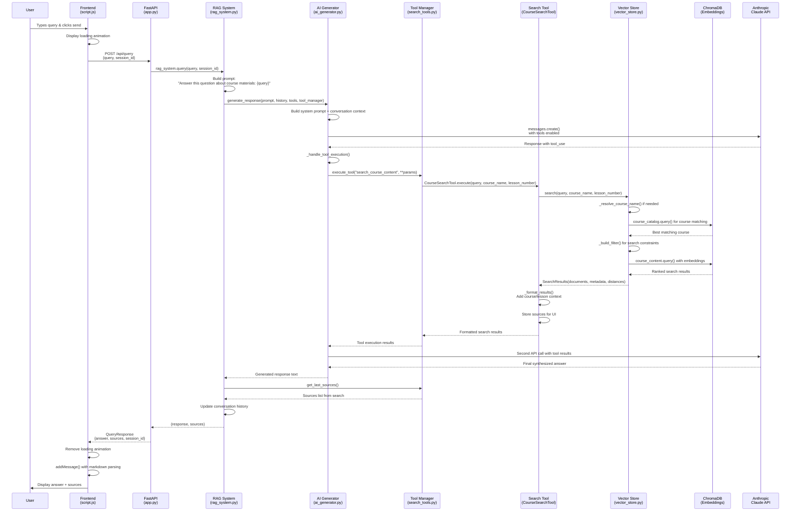

# RAG System Query Flow Diagram

## Key Components

### Data Flow Layers:
1. **Presentation**: Frontend JavaScript handles UI interactions
2. **API**: FastAPI routes and validates requests  
3. **Orchestration**: RAG System coordinates components
4. **Intelligence**: AI Generator manages Claude interactions
5. **Search**: Tool system executes semantic search
6. **Storage**: Vector Store queries ChromaDB embeddings

### Critical Transformations:
- **User Text** → **API JSON** → **Vector Search** → **Tool Results** → **AI Synthesis** → **HTML Display**

### Parallel Operations:
- Course name resolution and content search happen in sequence
- Tool execution and AI response generation are tightly coupled
- Frontend shows loading state while backend processes

### Error Handling:
- Each layer can return errors that propagate back to user
- Vector store handles missing courses gracefully
- Frontend displays error messages in chat interface